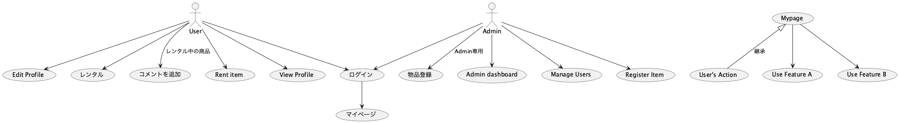
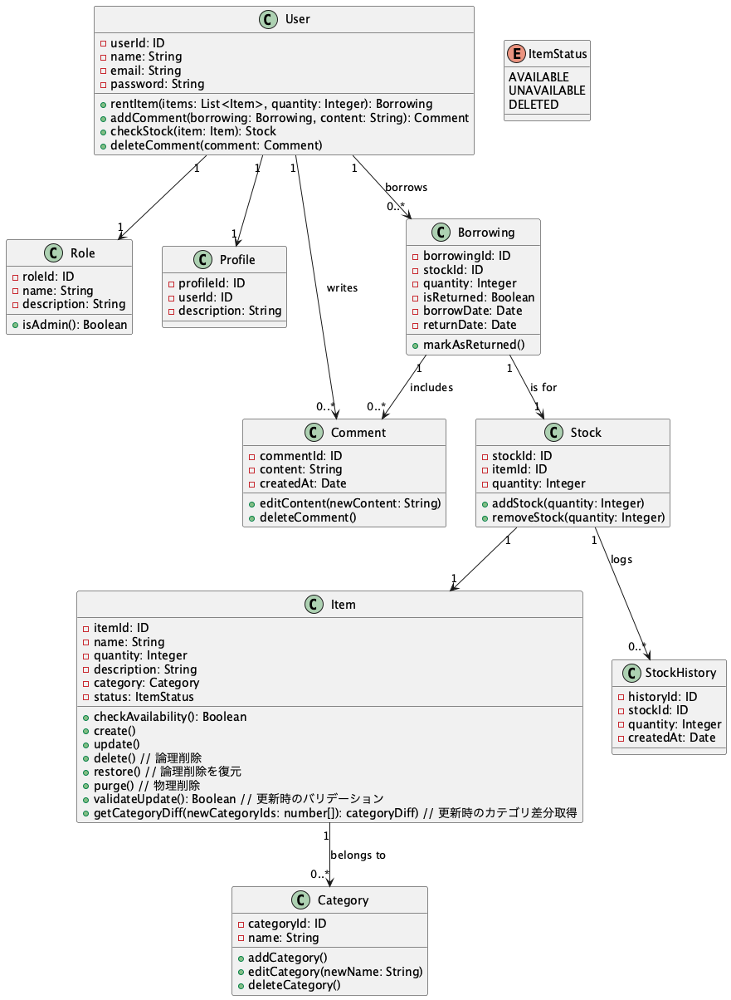
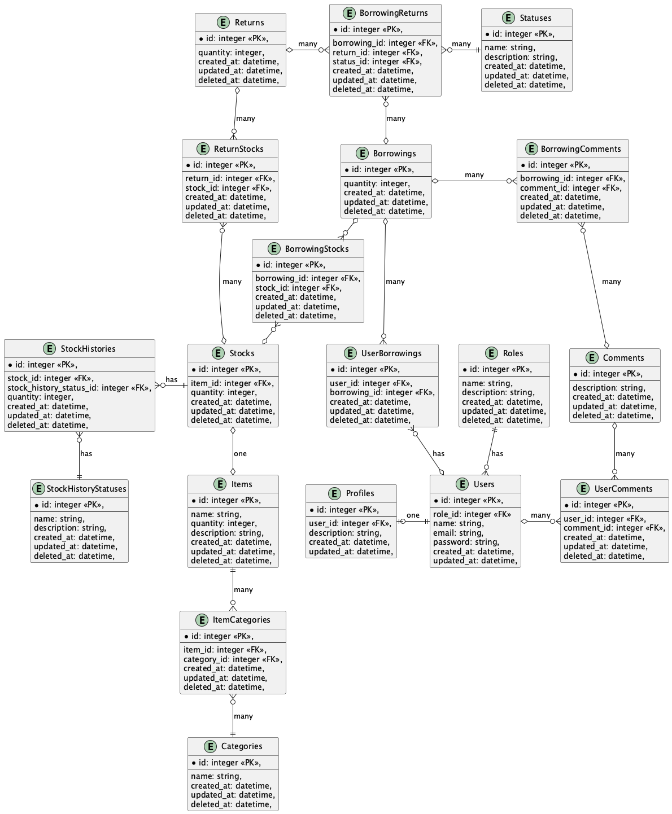

## 使用しているバージョンについて
- TypeScript: v5.8.2
- Node.js: v22.15.0
- npm: v10.5.0
- Nest.js: v11.0.7
- TypeORM: v0.3.20
- RxJS: v7.8.1

## 管理画面について
### APIドキュメントについて
起動後、以下のエンドポイントをブラウザでアクセスする
```
http://localhost:4000/swagger
```

### RabbitMQの管理画面の確認方法
1. docker composeでRabbitMQを起動
```
docker compose up mq -d
```
2. ブラウザで 下記のURLにアクセスする
```
http://localhost:15672/
```
3. ユーザー・パスワードは.envファイルに記載してあるものを入力する


## モデリングした内容について
### ユビキタス言語について
- [ユビキタス言語集のURL](https://docs.google.com/spreadsheets/d/1iG-OT2WOR4m4MekhEshM-utDvKH2KD6XZsPkvSSkf1k/edit?gid=0#gid=0)を参照

### ユースケースについて

### ドメインモデルについて

### データベース設計について



## READMEの更新
### ER図
1. 下記のコマンドでER図の新規画像を作成する
2. README.mdのパスを張り替える

```
chmod +x blue-print/shells/diagram.sh

./blue-print/shells/diagram.sh
```

### ドメインモデル図
1. 下記のコマンドでドメインモデル図の新規画像を作成する
2. README.mdのパスを張り替える

```
chmod +x blue-print/shells/domain-model.sh

./blue-print/shells/domain-model.sh
```


## dockerの起動方法

### Buildコマンド
```
 docker compose build
```

### 起動コマンド(logも見たいときは`-d`を外す)
```
 docker compose up -d
```

### テストコマンド
```
 docker compose --rm api npm run test (ファイル名)
```

### ライブラリのinstall
```
docker run --rm api npm install (ライブラリ名)
```

## TypeORMを用いたマイグレーションについて

※コンテナ上で実施したい場合、npmコマンドの前に随時`docker compose run`コマンドをつけること

※データが消失するのでバックアップをとったり、seedでいつでもデータ作成できるようにしておくこと！

1. 該当するエンティティファイルを編集して、マイグレーションファイルを作成する
```
npm run typeorm:migration:generate -- ./src/infrastructure/migrations/${返変更する内容に関する内容でファイル名を作成する}
```

2. 一度、DB用のコンテナを停止する
```
docker compose down
```

3. 既存のvolumesにデータが残っている場合は削除する
```
docker volume ls
```

```
docker volume rm ${volume名}
```

4. コンテナを再起動
```
docker compose build
```
#### apiコンテナを起動する
```
docker compose up api -d
```

#### DBコンテナを起動する
```
docker compose up db -d
```
#### RabbitMQコンテナを起動する
```
docker compose up mq -d
```
5. ビルドして、初期化する
```
npm run build
```

6. マイグレーションコマンドでテーブルを構築する
```
npm run typeorm:migration:run
```

## Seedデータの作成
```
npm run typeorm:seed:run
```

## Description

[Nest](https://github.com/nestjs/nest) framework TypeScript starter repository.

## Installation

```bash
$ npm install
```

## Running the app

```bash
# development
$ npm run start

# watch mode
$ npm run start:dev

# production mode
$ npm run start:prod
```

## Test

```bash
# unit tests
$ npm run test

# e2e tests
$ npm run test:e2e

# test coverage
$ npm run test:cov
```

## Support

Nest is an MIT-licensed open source project. It can grow thanks to the sponsors and support by the amazing backers. If you'd like to join them, please [read more here](https://docs.nestjs.com/support).

## Stay in touch

- Author - [Kamil Myśliwiec](https://kamilmysliwiec.com)
- Website - [https://nestjs.com](https://nestjs.com/)
- Twitter - [@nestframework](https://twitter.com/nestframework)

## License

Nest is [MIT licensed](LICENSE).
